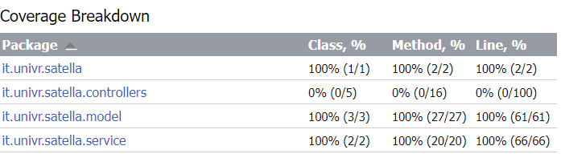
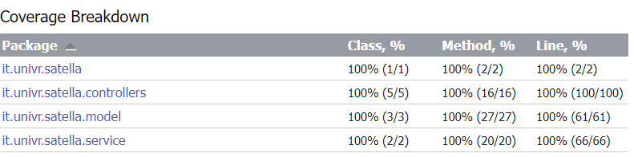

# Fondamenti di Ingegneria del Software - 2022/2023

Filippo Ziche (VR474022) - Samuele Besoli (VR489971)

# Requisiti

Satella è un software per la gestione di una stazione meteo, il suo obbiettivo principale è quello di essere flessibile e utilizzabile con diverse configurazioni di hardware sottostanti.

Per far questo permette all'utente di specificare quali punti di connessione (slot) per i sensori sono presenti nella stazione e che diversi valori di voltaggio e amperaggio essi forniscono.
Inoltre permette la gestione di una libreria di diversi modelli di sensori in modo da non costringere gli utenti a ricordare i dettagli di tutti i sensori che possiedono.

Per di più permette di collegare e scollegare attraverso l'interfaccia i sensori collegati negli slot della stazione, evitando lenti riavvii del sistema.

Ovviamente non tutti i sensori sono compatibili con tutti gli slot, quindi il sistema impedisce all'utente di collegare un sensore ad uno slot in cui i valori di voltaggio o amperaggio non sono supportarti, per evitare danni.

Il sistema è composto da un'interfaccia web in cui è possibile aggiungere, modificare, rimuovere e visualizzare i modelli di sensore nella libreria e assegnarli ai vari slot.

Inoltre deve permettere all'utente di specificare tramite i due file `sensors.json` e `slots.json` rispettivamente i sensori di default e gli slot presenti nella stazione.

# Scenari

Gli scenari a cui abbiamo pensato si dividono in 3 categorie:

- Caricamento della configurazione da file
- Gestione della libreria dei modelli di sensore
- Collegamento e scollegamento dei sensori dagli slot

## 1. Avviamento

### 1.1 Caricamento file di configurazione 

|                                | Descrizione                                                  |
| ------------------------------ | ------------------------------------------------------------ |
| **Initial assumption**         | La stazione è stata appena accesa e si sta avviando.         |
| **Normal function**            | La stazione legge i file `sensors.json` e `slots.json` e carica rispettivamente tutti i sensori e gli slot che sono stati specificati. |
| **What can go wrong**          | Se i file non sono presenti oppure non sono sintatticamente corretti la stazione si avvia normalmente ma senza alcun sensore nella libreria e senza slot definiti. |
| **Other activities**           | -                                                            |
| **System state on completion** | La stazione presenta nella libreria i modelli di sensori specificati, inoltre conosce gli slot della stazione. |

## 2. Gestione libreria

### 2.1 Aggiungere un sensore

|                                | Descrizione                                                  |
| ------------------------------ | ------------------------------------------------------------ |
| **Initial assumption**         | La stazione ha completato il caricamento e l'utente si trova nella pagina con la lista di sensori nella libreria. |
| **Normal function**            | L'utente clicca sul pulsante `Nuovo sensore`. Viene portato ad una pagina dove è possibile specificare le caratteristiche di un nuovo modello di sensore, in particolare il nome, l'intervallo di Volt e l'intervallo di Ampare che supporta. Per completare l'operazione l'utente clicca sul pulsante `Crea sensore` che lo riporta alla lista dei sensori. All'inizio della pagina è presente un messaggio di conferma. |
| **What can go wrong**          | Se i dati inseriti non sono corretti, ad esempio il valore minimo di Volt è superiore a quello massimo, allora appare un messaggio di errore all'inizio della pagina dopo che l'utente ha cliccato il pulsante `Crea sensore`. |
| **Other activities**           | Tramite il pulsante  `Annulla` l'utente può annullare l'operazione e tornare alla lista dei sensori. |
| **System state on completion** | Nella libreria è presente il nuovo sensore.                  |

### 2.2 Modificare un sensore

|                                | Descrizione                                                  |
| ------------------------------ | ------------------------------------------------------------ |
| **Initial assumption**         | La stazione ha completato il caricamento e l'utente si trova nella pagina con la lista di sensori nella libreria. |
| **Normal function**            | L'utente clicca sul pulsante `Modifica` presente di fianco al sensore che intende modificare. Viene portato ad una pagina dove è possibile impostare le caratteristiche del sensore. Per completare l'operazione l'utente clicca sul pulsante `Aggiorna sensore` che lo riporta alla lista dei sensori. All'inizio della pagina è presente un messaggio di conferma. |
| **What can go wrong**          | Se i dati inseriti non sono corretti, ad esempio il valore minimo di Volt è superiore a quello massimo, oppure la modifica del sensore lo rende incompatibile con uno slot a cui è collegato, allora appare un messaggio di errore all'inizio della pagina dopo che l'utente ha cliccato il pulsante `Aggiorna sensore`. |
| **Other activities**           | Tramite il pulsante `Annulla` l'utente può annullare l'operazione e tornare alla lista dei sensori. |
| **System state on completion** | Il sensore è stato aggiornato nella libreria                 |

### 2.3 Rimuovere un sensore

|                                | Descrizione                                                  |
| ------------------------------ | ------------------------------------------------------------ |
| **Initial assumption**         | La stazione ha completato il caricamento e l'utente si trova nella pagina con la lista di sensori nella libreria. |
| **Normal function**            | L'utente clicca sul pulsante `Modifica` presente di fianco al sensore che intende modificare. L'utente clicca sul pulsante `Elimina` e viene portato nuovamente alla libreria dei sensori con un messaggio di conferma. Se il sensore era collegato ad uno slot allora viene automaticamente scollegato. |
| **What can go wrong**          | -                                                            |
| **Other activities**           | -                                                            |
| **System state on completion** | Il sensore non è più presente nella libreria e non è più collegato ad alcuno slot. |

### 2.4 Visualizzare la libreria 

|                                | Descrizione                                                  |
| ------------------------------ | ------------------------------------------------------------ |
| **Initial assumption**         | La stazione ha completato il caricamento e l'utente si trova nella homepage. |
| **Normal function**            | L'utente clicca sul pulsante `Tutti i sensori` e viene portato alla visualizzazione della libreria dei sensori, ovvero una lista di sensori con specificato il nome e i loro limiti. |
| **What can go wrong**          | La libreria può essere senza alcun sensore, viene visualizzato quindi un avviso. |
| **Other activities**           | -                                                            |
| **System state on completion** | -                                                            |

## 3. Collegamento sensori

### 3.1 Collegare uno slot ad un sensore

|                                | Descrizione                                                  |
| ------------------------------ | ------------------------------------------------------------ |
| **Initial assumption**         | La stazione ha completato il caricamento e l'utente si trova nella homepage. |
| **Normal function**            | L'utente clicca sul pulsante `Collega` presente nel componente slot a cui intende collegare un sensore. Viene portato ad una lista di sensori presenti nella libreria e compatibili con quello slot. Da questa lista clicca sul pulsante `Seleziona` presente di fianco al sensore che ha scelto. Viene portato alla homepage con un messaggio di conferma. |
| **What can go wrong**          | La libreria non contiene sensori compatibili, viene visualizzato un avviso. |
| **Other activities**           | L'utente può annullare la scelta cliccando sul pulsante `Annulla`. |
| **System state on completion** | Nella homepage di fianco allo slot è presente il sensore selezionato con un pulsante `Disconnetti` per scollegarlo. |

### 3.2 Scollegare uno slot ad un sensore

|                                | Descrizione                                                  |
| ------------------------------ | ------------------------------------------------------------ |
| **Initial assumption**         | La stazione ha completato il caricamento e l'utente si trova nella homepage. |
| **Normal function**            | L'utente clicca sul pulsante `Disconnetti` presente nel componente slot su cui vuole rimuovere il sensore. Viene mostrato un messaggio di conferma della disconnessione. |
| **What can go wrong**          | -                                                            |
| **Other activities**           | -                                                            |
| **System state on completion** | Nella homepage di fianco allo slot non è più presente il sensore ed è apparso un pulsante `Collega` per collegarne uno nuovo. |

## Quality assurance

Per quanto riguarda la quality assurance, ci siamo affidati principalmente alla scrittura di test automatizzati con JUnit4, Selenium e occasionalmente alla revisione informale del codice scritto, cercando di fare refactoring e migliorare la qualità del codice periodicamente. In particolare abbiamo cercato di ridurre la complessità del progetto da quanto inizialmente previsto per aumentare il testing. 

## Test selection

I tests selezionati hanno sia l’obiettivo di simulare il comportamento reale dell’applicazione, con l’inserimento di dati realistici, sia quello di testare condizioni errate e inserimenti non validi.

## Unit testing

Tutte le classi che presentano almeno un metodo hanno associato un loro unit test. Queste sono divise fra classi del modello, presenti [qui](
src/test/java/it/univr/satella/model), e i service, presenti [qui](src/test/java/it/univr/satella/service).
Ci siamo assicurati di testare ogni metodo, compresi getters e setters. Inoltre ci siamo concentrati sul corretto caricamento dei file di configurazione all'avvio dei service `SlotService` e `SensorService`. Questo è essenziale per assicurare il corretto comportamento nel caso dello scenario 1.1.

## Code Coverage

Abbiamo verificato la code coverage dei nostri test attraverso il tool integrato di IntelliJ.

Abbiamo ottenuto il `100%` di coverage nei nostri unit test per quanto riguarda i `model`  e `service`.

È possibile consultare il report di coverage [qui](test/unit-report/index.html).

## End to End testing

Di seguito riportiamo, per ciascuno scenario descritto in precedenza, gli E2E test relativi e una piccola descrizione delle operazioni svolte. Ricordiamo che lo scenario 1.1 riguarda il caricamento della configurazione, quindi non è stato testato in questa sezione.

Abbiamo ottenuto il `100%` di coverage nei nostri end-to-end test per quanto riguarda i `controllers`. 

È possibile consultare il report di coverage [qui](test/e2e-report/index.html).

### 2.1 Aggiungere un sensore

| Test                    | Descrizione                                    |
| ----------------------- | ---------------------------------------------- |
| **[testSensorInsertCorrect]** | Aggiunge correttamente un sensore              |
| **[testSensorInsertInvalid]** | Aggiunge un sensore con dei campi non corretti |
| **[testSensorInsertCancel]**  | Annulla l'operazione di aggiunta               |

[testSensorInsertCorrect]: https://github.com/c0c4i/satella/blob/main/src/test/java/it/univr/satella/e2e/SensorInsertTest.java#L34
[testSensorInsertInvalid]: https://github.com/c0c4i/satella/blob/main/src/test/java/it/univr/satella/e2e/SensorInsertTest.java#L51
[testSensorInsertCancel]:  https://github.com/c0c4i/satella/blob/main/src/test/java/it/univr/satella/e2e/SensorInsertTest.java#L67

### 2.2 Modificare un sensore

| Test                          | Descrizione                                                  |
| ----------------------------- | ------------------------------------------------------------ |
| **[testSensorModifyCorrect]**       | Modifica correttamente un sensore                            |
| **[testSensorModifyInvalid]**       | Modifica un sensore con dei campi non corretti               |
| **[testSensorModifyCancel]**        | Annulla l'operazione di modifica                             |
| **[testSensorNotFoundModify]**      | Prova ad eliminare un sensore non presente nella libreria    |
| **[testSensorModifyNotCompatible]** | Prova a modificare un sensore in modo da renderlo incompatibile con uno slot a cui è attualmente collegato |

[testSensorModifyCorrect]: https://github.com/c0c4i/satella/blob/main/src/test/java/it/univr/satella/e2e/SensorModifyTest.java#L36
[testSensorModifyInvalid]: https://github.com/c0c4i/satella/blob/main/src/test/java/it/univr/satella/e2e/SensorModifyTest.java#L57
[testSensorModifyCancel]: https://github.com/c0c4i/satella/blob/main/src/test/java/it/univr/satella/e2e/SensorModifyTest.java#L96
[testSensorNotFoundModify]: https://github.com/c0c4i/satella/blob/main/src/test/java/it/univr/satella/e2e/SensorModifyTest.java#L74
[testSensorModifyNotCompatible]: https://github.com/c0c4i/satella/blob/main/src/test/java/it/univr/satella/e2e/SensorModifyTest.java#L81

### 2.3 Rimuovere un sensore

| Test                               | Descrizione                                                  |
| ---------------------------------- | ------------------------------------------------------------ |
| **[testSensorRemoveCorrectNotAttached]** | Elimina correttamente un sensore.                            |
| **[testSensorRemoveCorrectAttached]**    | Elimina correttamente un sensore che è stato in prededenza collegato ad uno slot |
| **[testSensorNotFoundRemove]**           | Modifica un sensore con dei campi non corretti               |

[testSensorRemoveCorrectNotAttached]: https://github.com/c0c4i/satella/blob/main/src/test/java/it/univr/satella/e2e/SensorRemoveSimpleTest.java#L35
[testSensorRemoveCorrectAttached]: https://github.com/c0c4i/satella/blob/main/src/test/java/it/univr/satella/e2e/SensorRemoveTest.java#L41
[testSensorNotFoundRemove]: https://github.com/c0c4i/satella/blob/main/src/test/java/it/univr/satella/e2e/SensorRemoveTest.java#L52

### 2.4 Visualizzare la libreria 

| Test                           | Descrizione                                                                          |
|--------------------------------|--------------------------------------------------------------------------------------|
| **[testListSensors]**          | Controlla che la libreria contenga i dati di default presenti nella demo.            |
| **[testListSensorsGoToSlots]** | Controlla che sia possibile tornare alla pagina degli slot dalla pagina dei sensori. |
| **[testListSensorsEmpty]**     | Controlla che sia visualizzata una notifica se non ci sono sensori.                  |

[testListSensors]: https://github.com/c0c4i/satella/blob/main/src/test/java/it/univr/satella/e2e/SensorViewTest.java#L34
[testListSensorsGoToSlots]: https://github.com/c0c4i/satella/blob/main/src/test/java/it/univr/satella/e2e/SensorViewTest.java#L48
[testListSensorsEmpty]: https://github.com/c0c4i/satella/blob/main/src/test/java/it/univr/satella/e2e/SensorEmptyTest.java#L39

### 3.1 Collegare uno slot ad un sensore

| Test                                    | Descrizione                                                                          |
|-----------------------------------------|--------------------------------------------------------------------------------------|
| **[testSlotAttachCorrect]**             | Collega correttamente un sensore ad uno slot.                                        |
| **[testSlotNotFoundAttach]**            | Prova a collegare un sensore ad uno slot non esistente.                              |
| **[testSlotAttachSensorNotFound]**      | Prova a collegare un sensore non esistente ad uno slot.                              |
| **[testSlotAttachSensorNotCompatible]** | Prova a collegare un sensore non compatibile ad uno slot.                            |
| **[testSlotAttachCancel]**              | Annulla l'operazione di collegamento.                                                |
| **[testSlotAttachShowOnlyCompatible]**  | Controlla che vengano visualizzati solo sensori compatibili con lo slot selezionato. |
| **[testSlotAttachSensorsEmpty]**        | Controlla che venga visualizzata una notifica se non ci sono sensori compatibili.    |
| **[testSlotEmpty]**                     | Controlla che sia visualizzata una notifica se non ci sono slot.                     |

[testSlotAttachCorrect]: https://github.com/c0c4i/satella/blob/main/src/test/java/it/univr/satella/e2e/SlotAttachTest.java#L35
[testSlotNotFoundAttach]: https://github.com/c0c4i/satella/blob/main/src/test/java/it/univr/satella/e2e/SlotAttachTest.java#L51
[testSlotAttachSensorNotFound]: https://github.com/c0c4i/satella/blob/main/src/test/java/it/univr/satella/e2e/SlotAttachTest.java#L60
[testSlotAttachSensorNotCompatible]: https://github.com/c0c4i/satella/blob/main/src/test/java/it/univr/satella/e2e/SlotAttachTest.java#L69
[testSlotAttachCancel]: https://github.com/c0c4i/satella/blob/main/src/test/java/it/univr/satella/e2e/SlotAttachTest.java#L78
[testSlotAttachShowOnlyCompatible]: https://github.com/c0c4i/satella/blob/main/src/test/java/it/univr/satella/e2e/SlotAttachTest.java#L88
[testSlotAttachSensorsEmpty]: https://github.com/c0c4i/satella/blob/main/src/test/java/it/univr/satella/e2e/SlotAttachTest.java#L105
[testSlotEmpty]: https://github.com/c0c4i/satella/blob/main/src/test/java/it/univr/satella/e2e/SlotEmptyTest.java#L39

### 3.2 Scollegare uno slot ad un sensore

| Test                   | Descrizione                                               |
| ---------------------- |-----------------------------------------------------------|
| **[testSlotDetachCorrect]**  | Scollega correttamente un sensore da uno slot.            |
| **[testSlotNotFoundDetach]** | Prova a sccollegare un sensore da uno slot non esistente. |

[testSlotDetachCorrect]: https://github.com/c0c4i/satella/blob/main/src/test/java/it/univr/satella/e2e/SlotDetachTest.java#L33
[testSlotNotFoundDetach]: https://github.com/c0c4i/satella/blob/main/src/test/java/it/univr/satella/e2e/SlotDetachTest.java#L45
